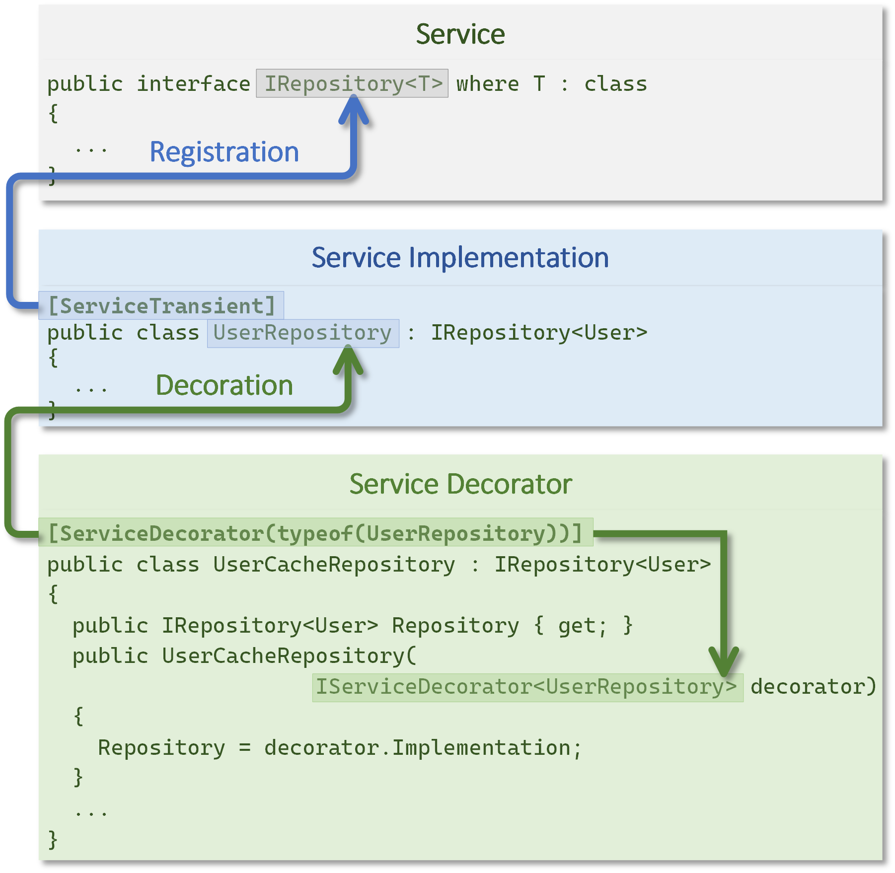

Services are the foundation of every ASP.NET Core application and are used through dependency injection. As an application grows, managing services becomes more complex and time-consuming. The following approach uses .NET Reflection to automatically register and decorate services.

<p align="center">
    
</p>

Service registration improves the maintainability and extensibility of the software. It allows an existing service to be replaced by a service with additional functionality without having to change it. Examples include caching of data, pre- or post-processing of data, or switching between different implementation variants.

### Setup
To use this tool, you must have the `ServiceRegistration.NET` NuGet package installed.
```
> dotnet add package ServiceRegistration.NET
```

Register the service registration in the DI container.
```csharp
// Program.cs
using ServiceRegistration.Service;
...
builder.Services.RegisterServices();
...
```

### Service Registration
The `ServiceSingleton`, `ServiceScoped`, and `ServiceTransient` attributes are used to define the service interface in the service implementation. The attribute correlates with the [lifetime](https://learn.microsoft.com/en-us/dotnet/core/extensions/dependency-injection#service-lifetimes) of the .NET dependency injection.

For decorators with multiple interface declarations, the `IRepository<User>` service type must be explicitly specified.
```csharp
[ServiceTransient(IRepository<User>)]
public class UserRepository : IRepository<User>, IDisposable
{
  ...
}
```

### Service Decoration
The `ServiceDecorator` attribute is used to specify the type of `UserRepository` to decorate in the `UserCacheRepository` decorator class. When the service is registered, the following steps are performed in the DI:
- Register the type of `UserRepository` to decorate.
- Register the service decorator `IServiceDecorator<UserRepository>` with `ServiceDecorator<UserRepository>`.
- Replace the `IRepository<User>` service registration of `UserRepository` with `UserCacheRepository`.

The `ServiceDecorator<T>` is a proxy type for the decorated type, available through the `Implementation` property.

Decoration can be applied to types that have a `Service*` attribute, or be a service decorator itself for nested scenarios. The lifecycle of registered services is determined by the service attribute.

With the extension method `IServiceCollection.DecorateService<TService, TDecorator, TComponent>` it is possible to decorate a service by code.
```csharp
// Program.cs
using ServiceRegistration.Service;
...
builder.Services.DecorateService<IRepository<User>, UserCacheRepository, UserRepository>();
...
```

### Registration Options
Service registration can be controlled using several options.
- Filter the reflection scan for assemblies and assembly types.
- Resolve service registration conflicts.
- Customize the target registration type.

By default, all assemblies of the current domain are scanned, which can be restricted using the `AssemblyFilter`. Types are restricted using the `TypeFilter`, where types with the `ServiceIgnore` attribute are generally ignored. In the following example, only `IRepository` service types are registered.

```csharp
builder.Services.RegisterServices(new()
{
  TypeFilter = type => type.GetInterfaces().Any(x =>
                         x.IsGenericType &&
                         x.GetGenericTypeDefinition() == typeof(IRepository<>))
});
```

If there are multiple registrations for a service, the conflicts must be resolved with the `ResolveRegistration` function or a runtime error will occur.
```csharp
builder.Services.RegisterServices(new()
{
    ResolveRegistration = (type, filetime, conflicts) => conflicts.Last() // custom conflict resolve
});
```

Before the services are registered in the DI, the `MapRegistration` function provides the ability to customize the type registrations.
```csharp
builder.Services.RegisterServices(new()
{
    MapRegistration = registration => registration.ImplementationType // custom registation mapping
});
```

### License and Download
- The project is licensed under the MIT License.
- NuGet package [ServiceRegistration.NET](https://www.nuget.org/packages/ServiceRegistration.NET/)
